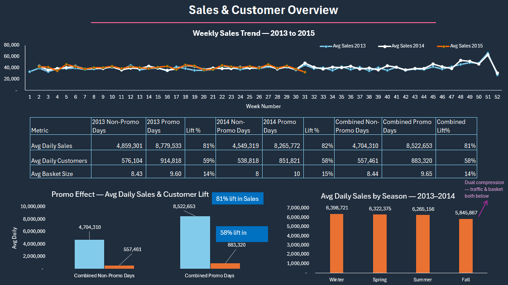
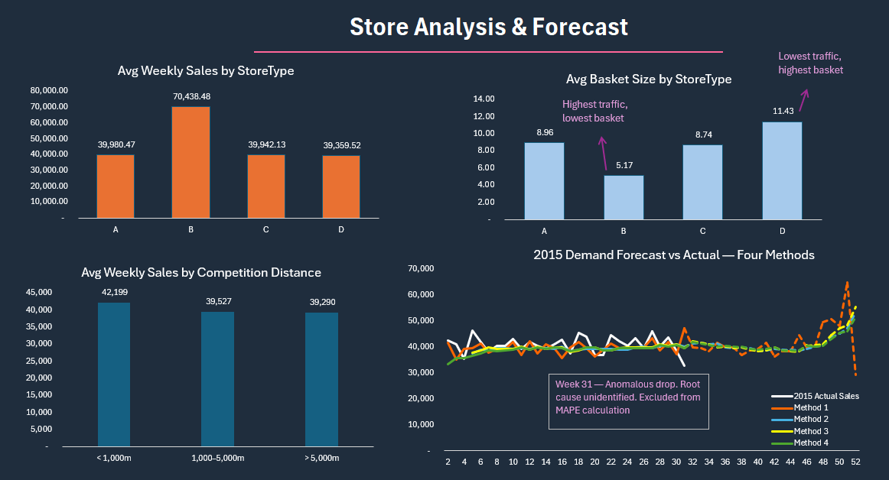

# Rossmann Retail Analytics — End-to-End Excel Project

**Tool:** Microsoft Excel (Advanced) | **Dataset:** Rossmann Store Sales (Kaggle) | **Status:** Complete

---

## Project Overview

An end-to-end retail analytics project built on the Rossmann Store Sales dataset — 1,115 stores across Germany, covering 2013–2015 weekly and daily sales data. The project follows a structured chapter roadmap from raw data exploration through demand forecasting, with a final Excel dashboard presenting key findings.

This project demonstrates applied retail analytics skills across the full planning cycle: data cleaning and aggregation, store performance analysis, promotional effectiveness, seasonality modeling, customer behavior, competitive analysis, and multi-method demand forecasting.

---

## Dashboard Preview

### Tab 1 — Sales & Customer Overview

### Tab 2 — Store Analysis & Forecast

---

## Project Structure

| Chapter | Topic | Key Output |
|---|---|---|
| CH01 | Data Understanding & EDA | Dataset profiling, data quality flags, column mapping |
| CH02 | Data Cleaning & Aggregation | Agg_Daily and Agg_Weekly tables, outlier handling |
| CH03 | Store Performance | StoreType baseline, Avg Weekly Sales, Basket Size, CV analysis |
| CH04 | Promotional Analysis | Promo lift quantification, Promo2 trajectory analysis |
| CH05 | Seasonality | 52-week seasonal index, MAPE 5.7%, Week 31 anomaly flagged |
| CH06 | Customer Analysis | YoY traffic decomposition, DOW patterns, seasonal customer behavior |
| CH07 | Competition Analysis | Distance band performance, tenure analysis, StoreType × competition cross-tab |
| CH08 | Demand Forecasting | Four-method forecast comparison, StoreType and Assortment level forecasts |
| S09 | Excel Dashboard | Two-tab executive dashboard — Sales Overview and Store & Forecast |

---

## Key Findings

### Sales & Promotional Performance
- **81% sales lift** and **58% customer lift** on promotional days vs non-promo weekdays
- Promo2 stores show faster trajectory growth than absolute comparison suggests — CH04 addendum required
- 180 stores not participating in Promo1 — cross-reference with StoreType and Assortment flagged for further analysis

### Store Format Analysis
- **Type B** stores generate 75% higher weekly sales than any other format (avg €70,438/week) but carry the lowest basket size (€5.17) — exclusively urban, competition-dense locations
- **Type D** stores show the inverse — lowest traffic, highest basket size (€11.43) — rural/suburban premium format
- Type A and C are structurally identical — chain backbone at ~€40,000/week

### Seasonality
- **Fall is the only season with dual compression** — traffic -3.8% AND basket -2.2% below chain average simultaneously
- Seasonal index built on 2013–2014 baseline; 2015 used as validation holdout (Jan–Jul only)
- Week 31 confirmed anomaly (-43% vs forecast) — root cause unidentified

### Competition Analysis
- **Proximity to competition drives traffic, not away** — stores within 1km average 43% more customers and 7% more sales than isolated stores
- Basket compression trade-off: stores closest to competitors have 25% lower basket size
- Type B is exclusively urban — zero Type B stores beyond 5km from a competitor

### Demand Forecasting
| Method | MAPE |
|---|---|
| Seasonal Index × Trend | **5.7%** ← Winner |
| 4-Week Moving Average | 6.2% |
| Weighted Moving Average | 6.3% |
| Exponential Smoothing (α=0.3) | 7.1% |

- Seasonality is the dominant demand signal — any method ignoring it underperforms
- **B-b combination (Type B × Assortment b) MAPE = 14.61%** — chronic under-forecast with all positive errors, indicating systematic demand underestimation and stock-out risk
- StoreType × Assortment cross-forecast: 8 of 9 combinations perform at or better than chain level

---

## Tools & Techniques

| Category | Detail |
|---|---|
| Data Aggregation | SUMIFS, AVERAGEIFS, COUNTIFS, pivot-style aggregation tables |
| Forecasting | Seasonal Index, Moving Average (simple & weighted), Exponential Smoothing |
| Accuracy Measurement | MAPE, signed error analysis, validation holdout (2015 Jan–Jul) |
| Segmentation | StoreType × Assortment cross-analysis, competition distance banding, tenure banding |
| Visualization | Excel dashboard — dark theme, annotated charts, dual-tab layout |

---

## Dataset

**Source:** [Rossmann Store Sales — Kaggle](https://www.kaggle.com/competitions/rossmann-store-sales)

- 1,115 stores
- ~1M daily sales records (2013–2015)
- Features: Store, StoreType, Assortment, CompetitionDistance, Promo, Promo2, Sales, Customers

---

## Author

**Hamed Tamjidyamchelo**
Retail Analytics | Buying & Planning | Supply Chain

- LinkedIn: [linkedin.com/in/hamed-tamjidyamchelo](https://www.linkedin.com/in/hamed-tamjidyamchelo/)
- GitHub: [github.com/hamed-tamjidi](https://github.com/hamed-tamjidi)
- Portfolio: [github.com/hamed-tamjidi/retail-analytics-portfolio](https://github.com/hamed-tamjidi/retail-analytics-portfolio)

---

*Part of a retail analytics portfolio including H&M Power BI project and Tankhoone Fashion Retail Excel project.*
